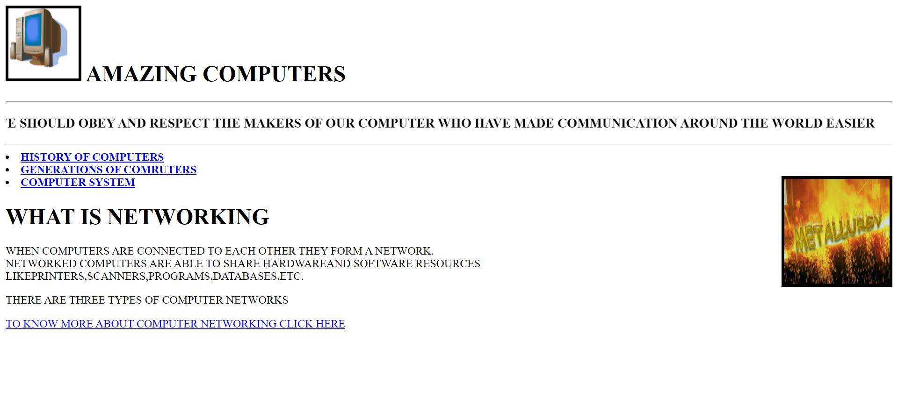
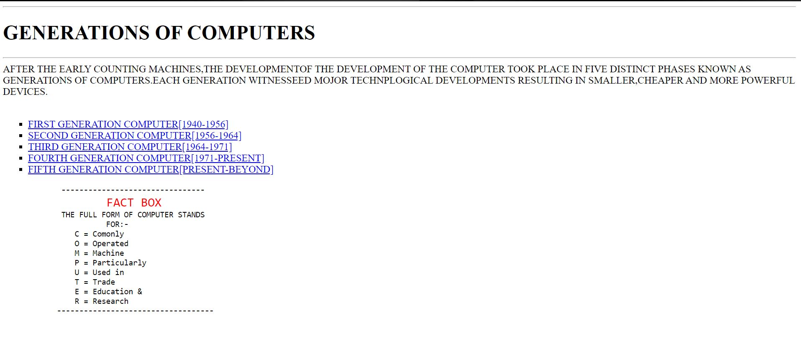
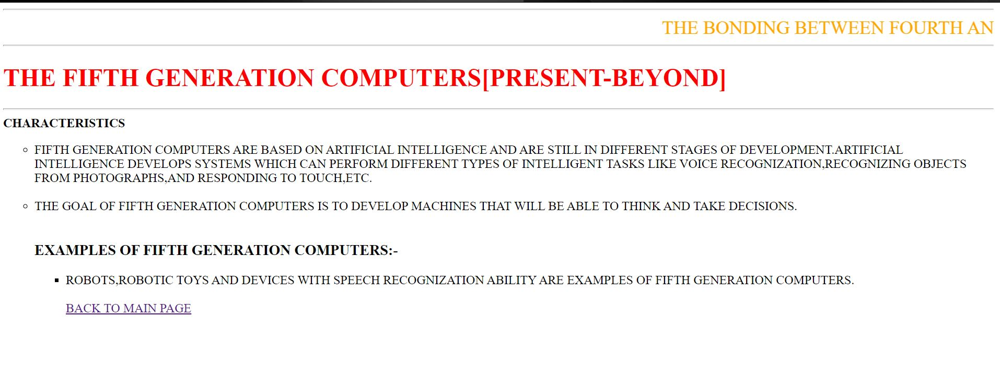
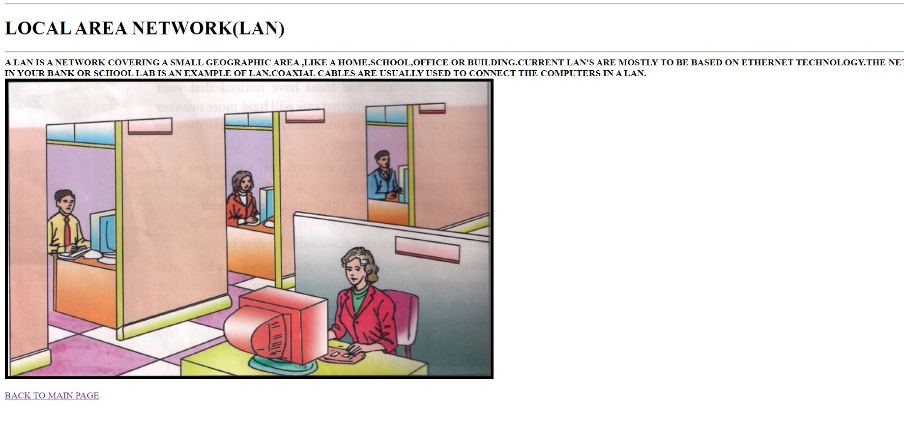

#### My First HTML based project

This is the first website I ever built using just HTML code. It is a very basic HTML encoded project that I built in class 5 at the age of 10 when i first started learning about HTML. I was very naive and a rookie back then so please pardon the out of date unattractive website quality and sit back and enjoy the innocence and effort that I put in this project all those years ago... ;)

* This is meant to be just a show for my history
* Hope u will like it
* I'm also adding few screen shots to it to just look cool thats all. XD

**1. Home page**

---
**2. Surfing throught the website**

---
**3. Basically made for exploring interests in coding for kids who are thinking of learning coding from the age of 10-15**

---
**4. Will also help learning something more while browsing through this website**

###### [^1]: Hope u will like it... ;D
###### [^1]: Happy Coding b^.^d
